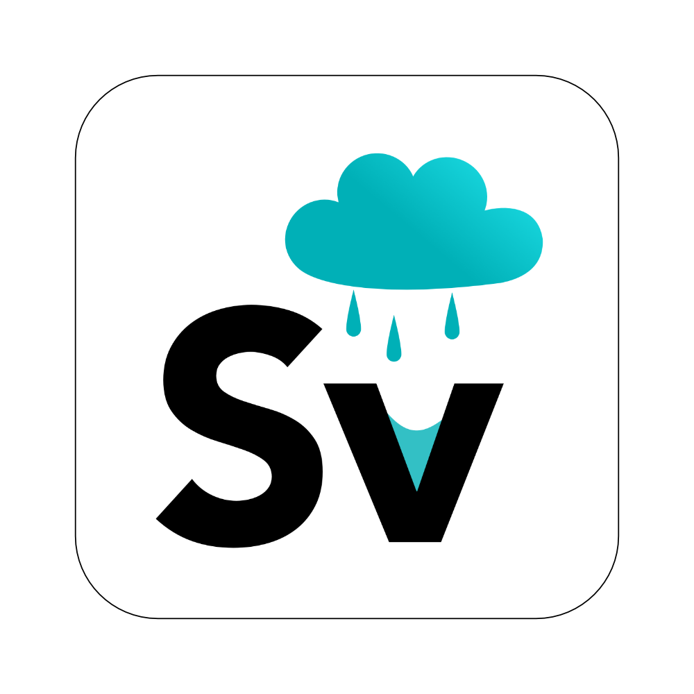

	

# Stormventory

_Save your belongings, one memory at a time. Document what you own, so you can keep track when everything goes off the rails._

## Inspiration
Right before a disaster, people are focused on getting too safety; right after, all they want is to return to their own lives. Thinking about insurance and recovery are hard topics to deal with among those circumstances.

We wanted to build something that was practical, helpful, and intuitive -- a solution that didn't exist for solutions' sake, or one that got in the way of people's life. Keeping track of one's belongings before and after a storm fulfilled these goals, and had a open space for AI (namely, image classification) to fill.

## What it does
Stormventory ("storm" + "inventory") allows users to catalog their possessions. This is helpful before a natural disaster -- if a house is flooded, for example, there will be no record of what the user owned, how much it was worth, et cetera.

The key to this comes by way of IBM Cloud image classification. When the user takes a picture of their possession to catalog it, IBM Cloud will analyze the image to self-classify it. It can tell if the object is a gray tweed chair, and automatically organize it under the "furniture" category. This allows the user to focus on adding the salient details (memories of the chair, etc.) instead of worrying about the technical organization of their inventory.

## How I built it
I built the iOS app natively using Swift, UIKit, and Xcode. Authentication was handled with Auth0, and I communicated with a custom backend by Wiley and Bryan to store user data (items, and their corresponding images/metadata). I initially was planning on building the IBM Cloud calls directly into the client, however it made more sense to put them in the backend once we got running with development.

Note that the backend is in a separate repository, linked in the README of the GitHub link below. IBM is implemented there!

## Challenges I ran into
Some challenges include: using outdated libraries for UICollectionView layouts, getting the design to a point where I was happy with it, and dealing with networking in iOS. 

## What's next for Stormventory
Next would be fleshing this out to include AR support -- as you move your camera around the room, it would classify objects in realtime and put their generated descriptions in 3D next to the object. This would be a much more seamless link between the inventory system and the real world!

